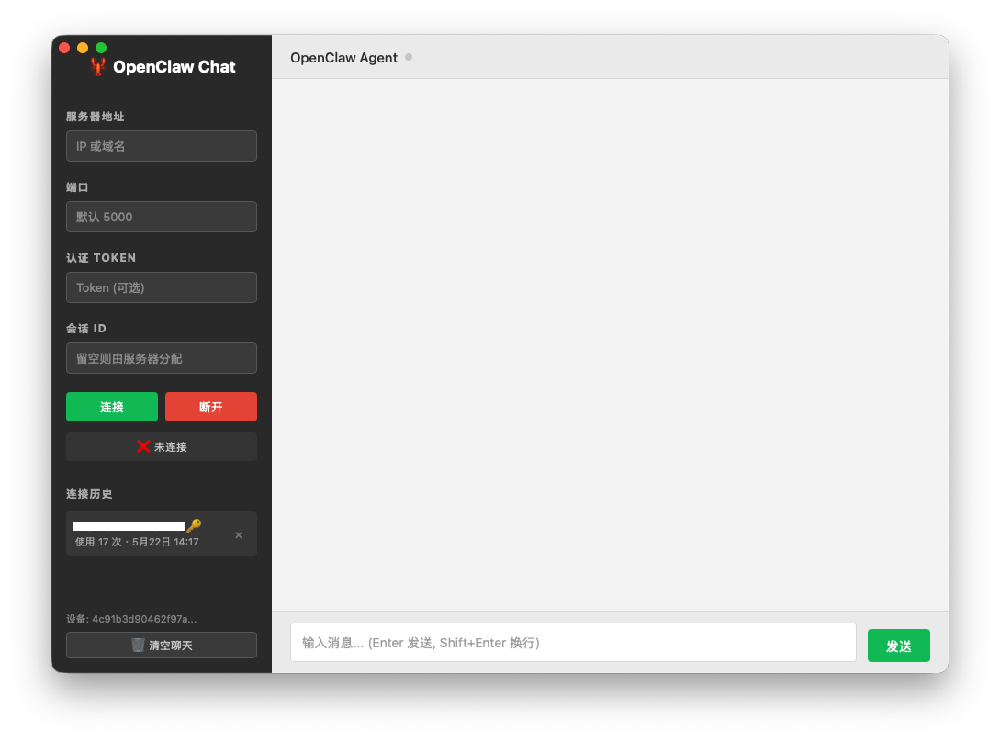

<p align="center">
  
</p>

# OpenClaw Chat Client

一个基于 Go + Wails 实现的 OpenClaw Gateway 桌面聊天客户端，支持 macOS / Windows / Linux 三平台。通过 OpenClaw WebSocket 协议直接与 AI 通信，体积小巧（~9MB），使用系统原生 WebView 渲染。

## 架构

```
┌─────────────────────────────────────┐        WebSocket (Proto v4)        ┌────────────────────┐
│  OpenClaw Chat Client               │ ←────────────────────────────────→ │ OpenClaw Gateway   │
│  ┌───────────┐  ┌─────────────────┐ │       ws://host:port/ws           │                    │
│  │ Go 后端    │  │ HTML/CSS/JS 前端│ │                                   └────────────────────┘
│  │ (Wails)   │  │ (WebView)       │ │
│  └───────────┘  └─────────────────┘ │
└─────────────────────────────────────┘
```

## 功能特性

- 🖥️ **原生桌面应用** — 使用系统 WebView，体积小、内存占用低
- 🔐 **Ed25519 设备身份** — 自动生成密钥对，设备级安全认证
- 📝 **流式输出** — 实时显示 AI 回复，打字机效果
- 📋 **连接历史** — 自动记录连接信息（host/port/token/sessionId），支持一键恢复
- 🔄 **会话恢复** — 记录会话 ID，下次连接可恢复到同一对话上下文
- ⚡ **工具调用** — 支持 AI 工具使用审批（自动批准）
- 🌐 **跨平台** — 支持 macOS、Windows、Linux

---

## 环境要求

在编译之前，请确保已安装以下依赖：

| 依赖 | 版本要求 | 说明 |
|------|----------|------|
| **Go** | ≥ 1.21 | [下载地址](https://go.dev/dl/) |
| **Wails CLI** | v2 | Wails 构建工具 |
| **Node.js** | ≥ 16 (可选) | Wails 初始化时可能需要，本项目前端无需构建 |

### 各平台额外依赖

#### macOS

```bash
# Xcode 命令行工具（提供 clang 编译器）
xcode-select --install
```

#### Windows

- [WebView2 Runtime](https://developer.microsoft.com/en-us/microsoft-edge/webview2/) （Win10/11 通常已自带）
- [MSVC Build Tools](https://visualstudio.microsoft.com/visual-cpp-build-tools/) 或 Visual Studio

#### Linux (Debian/Ubuntu)

```bash
sudo apt install -y libgtk-3-dev libwebkit2gtk-4.0-dev
```

---

## 编译步骤

### 1. 安装 Go

从 https://go.dev/dl/ 下载并安装 Go（≥ 1.21）。验证：

```bash
go version
# 输出示例: go version go1.24.2 darwin/arm64
```

### 2. 安装 Wails CLI

```bash
go install github.com/wailsapp/wails/v2/cmd/wails@latest
```

安装后确保 Go bin 目录在 PATH 中：

```bash
# 查看 Go bin 路径
go env GOPATH
# 通常为 ~/go

# 添加到 ~/.zshrc 或 ~/.bashrc
export PATH=$PATH:$(go env GOPATH)/bin
```

验证安装：

```bash
wails version
```

### 3. 检查环境

```bash
wails doctor
```

此命令会检查所有编译依赖是否就绪，并给出修复建议。

### 4. 下载依赖

```bash
cd openclaw-chat-client
go mod tidy
```

### 5. 开发模式运行（热重载）

```bash
wails dev
```

这会启动带热重载的开发模式，修改前端 HTML/CSS/JS 后自动刷新。

### 6. 构建正式版

```bash
# macOS (生成 .app 包)
wails build -o openclaw-chat

# macOS Universal (Intel + Apple Silicon)
wails build -platform darwin/universal -o openclaw-chat

# Windows (在 Windows 上执行)
wails build -platform windows/amd64 -o openclaw-chat.exe

# Linux (在 Linux 上执行)
wails build -platform linux/amd64 -o openclaw-chat
```

构建产物位于：

```
build/bin/
├── openclaw-chat.app/    # macOS 应用包
│   └── Contents/
│       └── MacOS/openclaw-chat
├── openclaw-chat.exe     # Windows 可执行文件
└── openclaw-chat         # Linux 可执行文件
```

---

## 使用方法

### 启动应用

- **macOS**：双击 `build/bin/openclaw-chat.app`，或拖入「应用程序」文件夹
- **Windows**：双击 `openclaw-chat.exe`
- **Linux**：运行 `./openclaw-chat`

### 连接到 OpenClaw Gateway

1. 在左侧面板填写连接信息：
   - **服务器地址** — Gateway 的 IP 或域名（默认 `localhost`）
   - **端口** — Gateway 端口（默认 `5000`）
   - **Token** — 认证 Token（本地回环可不填）
   - **会话 ID** — 留空由服务器分配，填入已有 ID 可恢复对话
2. 点击 **「连接」** 按钮
3. 状态栏显示「✅ 已连接」后即可开始聊天

### 连接历史

- 每次连接成功后自动保存 host/port/token/sessionId
- 左侧「连接历史」列表显示所有曾经连接过的服务器
- 点击历史记录自动填充连接信息，再点连接即可快速恢复
- 最多保留 20 条记录，按最近使用排序

### 会话恢复

- 首次连接成功后，会话 ID 会自动显示在输入框中
- 该 ID 随历史记录保存
- 下次连接同一服务器时，使用相同的会话 ID 可恢复之前的对话上下文

---

## 项目结构

```
openclaw-chat-client/
├── main.go              # 入口，启动 Wails 桌面应用
├── config.go            # 配置管理 & Ed25519 设备身份
├── protocol.go          # OpenClaw WebSocket 协议 v4 定义
├── ws_client.go         # WebSocket 客户端核心（连接、握手、收发消息）
├── wails_app.go         # Wails 后端逻辑（暴露给前端的方法）
├── history.go           # 连接历史记录管理
├── frontend/
│   ├── index.html       # 前端页面（HTML/CSS/JS 一体）
│   └── wailsjs/         # Wails 自动生成的 JS 绑定
├── build/
│   ├── appicon.png      # 应用图标
│   ├── darwin/          # macOS 构建配置
│   └── bin/             # 构建产物输出目录
├── wails.json           # Wails 项目配置
├── go.mod               # Go 模块定义
└── go.sum               # 依赖校验
```

## 主要依赖

| 依赖 | 用途 |
|------|------|
| [wails/v2](https://wails.io/) | 桌面应用框架（Go + WebView） |
| [gorilla/websocket](https://github.com/gorilla/websocket) | WebSocket 客户端连接 |

## 数据存储

应用数据存储在用户主目录下：

```
~/.openclaw-chat-client/
├── device.json                 # Ed25519 设备密钥对
└── connection_history.json     # 连接历史记录
```

---

## 协议说明

本客户端使用 OpenClaw Gateway 的 **WebSocket Proto v4** 协议：

### 握手流程

```
客户端                              服务器
  │                                   │
  │ ── ws 连接 ──────────────────────→│
  │                                   │
  │←── challenge (nonce) ─────────────│
  │                                   │
  │ ── connect (Ed25519签名+设备信息)→│
  │                                   │
  │←── hello-ok (connId) ─────────────│
  │                                   │
  │ ══ 已连接，可发送消息 ═══════════ │
```

### 消息收发

- **发送消息**：通过 RPC 方法 `chat.send`，携带 `sessionKey` 和 `text`
- **接收回复**：通过事件流 `stream_start` → `stream_delta`(多次) → `stream_end`
- **工具调用**：收到 `tool_approval_request` 后自动回复 `approve`

---

## 多设备 / 分发部署

### 设备配对机制

OpenClaw Gateway 使用 **设备配对** 机制进行安全认证。客户端首次连接时会自动生成 Ed25519 密钥对和 `deviceId`，但该设备需要在 Gateway 上 **完成配对审批** 后才能正常通信。

如果连接时出现以下错误，说明设备尚未配对：

```
cause: "pairing-required"
reason: "not-paired"
```

### 方案一：拷贝已配对的设备身份（推荐）

将已配对电脑上的设备身份文件拷贝到新电脑，即可直接复用已配对的身份：

```bash
# 在已配对的电脑上找到设备文件
cat ~/.openclaw-chat-client/device.json

# 在新电脑上创建目录并写入相同内容
mkdir -p ~/.openclaw-chat-client
# 将 device.json 拷贝到新电脑的 ~/.openclaw-chat-client/device.json
```

### 方案二：在 Gateway 服务器上手动审批新设备

如果你有 Gateway 服务器的 SSH 权限，可以手动审批：

#### 1. 查看待审批设备列表

```bash
# SSH 登录到 Gateway 服务器后执行
openclaw devices list --json
```

输出示例：

```json
{
  "pending": [
    {
      "requestId": "2cc54336-6f98-486f-a669-33321115c07d",
      "deviceId": "4c91b3d90462f97ae738a10821cd3ef8c457c18d5dcbf4d3ea327cc14e0cd2a2",
      "publicKey": "...",
      "createdAt": "2026-05-22T01:07:15Z"
    }
  ],
  "approved": [
    ...
  ]
}
```

#### 2. 审批设备

```bash
# 使用 pending 列表中对应设备的 requestId
openclaw devices approve <requestId>

# 示例
openclaw devices approve 2cc54336-6f98-486f-a669-33321115c07d
```

审批成功后，新设备即可正常连接。

### 分发清单

将应用分发给其他人使用时，需要提供以下文件（或在服务器上完成配对审批）：

| 需要拷贝的内容 | 路径 | 说明 |
|---|---|---|
| App 本体 | `build/bin/openclaw-chat.app` | 程序文件 |
| 设备密钥（可选） | `~/.openclaw-chat-client/device.json` | 共享已配对身份则无需服务端审批 |
| 连接历史（可选） | `~/.openclaw-chat-client/connection_history.json` | 携带历史记录 |

> ⚠️ **安全提示**：`device.json` 包含 Ed25519 私钥，共享意味着多台设备共用同一身份。如对安全性要求较高，建议每台设备独立生成密钥，然后在 Gateway 上逐一审批。

---

## 注意事项

1. **设备配对**：新设备首次连接需要完成配对审批（拷贝 `device.json` 或在服务器上 `openclaw devices approve`）
2. **认证**：非本地连接需要配置正确的 Token
3. **网络**：确保防火墙允许 WebSocket 连接到目标端口
4. **端口**：OpenClaw Gateway 默认端口为 `5000`（生产环境可能是 `10646`）
5. **跨平台编译**：Wails 不支持交叉编译，需在目标平台上分别构建（可用 GitHub Actions 实现 CI/CD 自动化）
